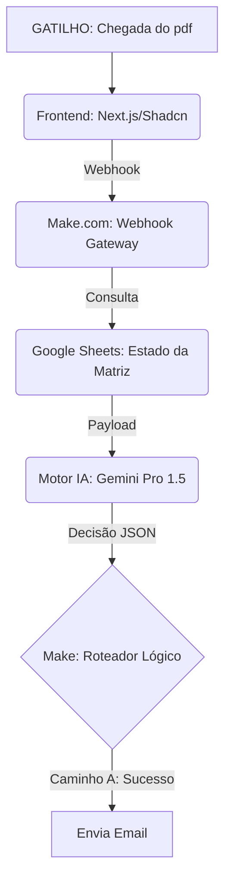

# 🏗️ Operações do estaleiro


**🔗 Aplicação Online:** [https://operacoes-estaleiro.vercel.app/]<br>
**Link Make** [https://us2.make.com/public/shared-scenario/J7BbuXUVbDo/projeto]
---

## 📌 Visão Geral

O **Projeto Operaçoes do estaleiro** é a evolução do sistema de gestão de controle de estoque do estaleiro 

## 🧠 Motor de Decisão (Regras de Negócio - Desafio 1)

1. O operador envia pdf/imagem e email de destinatario via frontend
2. A IA processa o pedido(criando e comparando tabelas)
3. A IA envia email com uma tabela de dados.
---

## ⚙️ Arquitetura Técnica

### Fluxo de Dados



## 🛠️ Tecnologias Utilizadas

- **Frontend:** Next.js, TypeScript, Tailwind CSS, Shadcn/UI, Lucide React.
- **Backend/Orquestração:** Make.com (Low-Code/No-Code Integration).
- **IA Cognitiva:** Google Gemini API (Prompt Engineering focado em roteirização logística).
- **Database:** Google Sheets (Matriz de estados).

---

## 🚀 Como Executar Localmente

### Pré-requisitos

- Node.js (v18+)
- NPM ou PNPM
- Conta ativa no Make.com e Google Cloud (para API do Gemini)

### Passos de Instalação

1. **Clone o repositório:**

```bash
git clone https://github.com/joaosilvateixeira33/shipyard-sync-flow

```

1. **Instale as dependências:**

```bash
npm install

```

ou

```bash
pnpm install
```

1. **Configure as variáveis de ambiente:**
   Crie um `.env.local` na raiz com o link do seu Webhook do Make.com.
2. **Inicie o servidor:**

```bash
npm run dev

```

ou

```bash
pnpm dev
```
---

## 📝 Documentação da Automação (Backend)

O arquivo `backend/blueprint-roteirizador.json` contém a arquitetura lógica do Make.com.

- **Ajustes necessários:** Importe este JSON no seu cenário do Make.com para replicar a lógica de busca do Google Sheets e a chamada à API do Gemini.
- **Customização:** A lógica da regra de 40% e o isolamento de cargas IMO está encapsulada no módulo `Generate a Response` (Gemini) do cenário.

-

## 🎓 Créditos e Contexto

Projeto desenvolvido como parte do desafio técnico da **KODIE Academy** em parceria com a **Wilson Sons**.

- **Versão:** 2.0.0
- **Status:** Projeto concluido.

---

## 👨‍💻 Desenvolvido por

<a href="https://www.linkedin.com/in/eduardogomes377">
  
</a>
<br />
<strong>João Marcos Silva</strong>
<br />
<em>Full Stack Developer</em>
<br /><br />
<a href="https://www.linkedin.com/in/jo%C3%A3o-silva-fullstack/">
  
</a>
